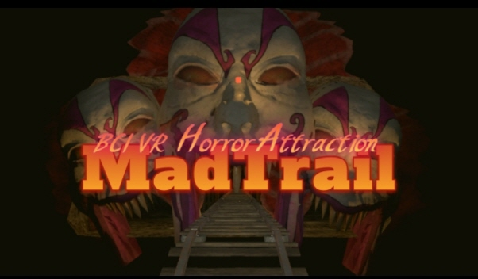
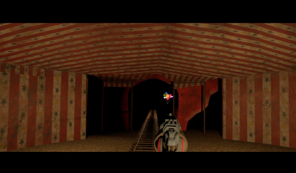
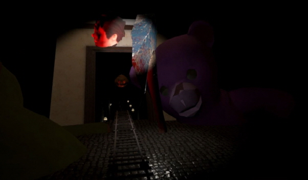
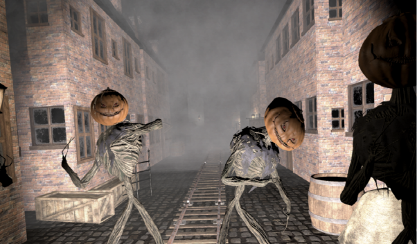
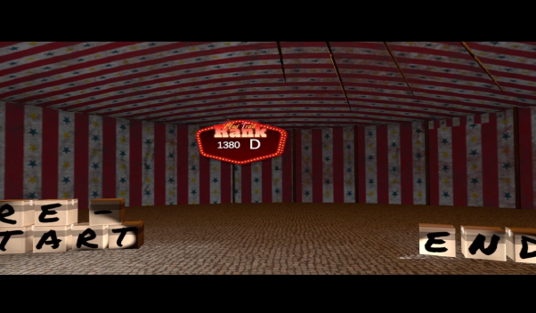
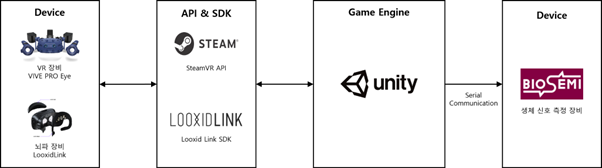

# BCI VR Horror Attraction: The Mad Trail

**The Mad Trail**는 뇌-컴퓨터 인터페이스(BCI: Brain-Computer Interface) 기반 어트랙션 VR 호러 게임입니다.

> 자세한 내용 및 사용방법은 본문 자료(메뉴얼)를 참고해주시기 바랍니다.

 

## 1. 게임 개요 ##

**The Mad Trail**는 VR 공포 어트랙션으로, 플레이어는 놀이공원의 한 공포 롤러코스터에 탑승한다. 플레이어는 롤러코스터를 타고 가면서 주변에 보이는 풍선이나 자신을 공격하는 몬스터를 총으로 쏠 수 있고, 이를 통해 점수를 얻을 수 있다. 플레이 동안 플레이어의 뇌파를 측정하여 플레이어의 뇌파가 특정 트리거값을 넘을 때 공포 연출을 실행한다. 

 

> <그림1> 게임 메인 로고이다.

 

**The Mad Trail**는 BCI와 VR을 접목한 공포 게임입니다. 튜토리얼 모드, 뇌파 공포 연출 디펜스 모드, 점수 확인을 할 수 있습니다.
> 사용자의 베타파와 세타파의 비율을 계산하여 집중력 정도를 측정하였고 이 비율의 변화량이 일정 값 이상 되었을 때 공포 자극을 제공하려고 하였다. 하지만, 사용자마다 다른 패턴의 뇌파와 공포 자극을 제공하였을 때 나타나는 뇌파의 수치가 달라 기존의 식 대신 Looxid Link에서 제공해주는 Attention 값을 다음에 사용했다. Attention 값은 실시간으로 측정되는 사용자의 뇌 신호를 바탕으로 집중 정도를 나타낸다. 따라서, Attention 지표를 통해서 게임 중 사용자의 집중 정도를 확인할 수 있고, 이는 게임에 대한 몰입감으로도 해석할 수 있다. 따라서 Attention 값이 0.99보다 높아지면 게임에 대한 사용자의 몰입이 높아졌다고 판단하여 공포 연출(점프 스케어)를 제공한다. 

 

#### 1.1. 튜토리얼 모드
: 게임을 실행했을 때 처음 나오는 어트랙션의 첫 화면이다. 실행 직후 1분가량 후에 튜토리얼 논평과 플레이어가 표적을 총으로 쏘는 것을 연습할 수 있도록 한다. 사용자가 튜토리얼을 마치면 사용자가 탑승한 코스터가 앞으로 출발하면서 자연스럽게 본 게임이 진행된다. 

> <그림2> Mad Trail 첫 시작화면 및 튜토리얼 화면 
> : 게임을 실행했을 때 처음 나오는 어트랙션의 첫 화면이다.

 

#### 1.2. 뇌파 공포 연출
: 플레이어가 종료 구간에 도착하면 지금까지 풍선을 맞춰서 얻은 점수와 등급을 보여주는 인 게임 화면이다. 여기서 플레이어는 재시작을 할 수도 있고, 게임을 종료할 수도 있다.

> <그림3> 뇌파 공포 연출
> : Attention 수치가 0.99 이상일 경우 공포 연출 제공

 

#### 1.3. 디펜스 모드
: MadTrail의 main 구간인 런던과 호텔 구간의 에디터 화면이다. 해당 구간에서는 플레이어가 풍선뿐만 아니라 등장하는 몬스터를 처치해야 한다. 

> <그림4> 디펜스 모드
> : VR 컨트롤러를 사용하여 적들과 상호작용 할 수 있다.

 

#### 1.4. 점수 확인
: 플레이어가 종료 구간에 도착하면 지금까지 풍선을 맞춰서 얻은 점수와 등급을 보여주는 인 게임 화면이다. 여기서 플레이어는 재시작을 할 수도 있고, 게임을 종료할 수도 있다.

> <그림5> 점수 확인

 

## 2. BCI 시스템 개발 환경

> <그림5> SteamVR-LooxidLink-Unity-Biosemi 시스템 구조

<table>
<tr>
    <td><b> OpenVR API & SteamVR Unity Plug-in</b></td>
    <td> LooxidLink SDK는 Looxid Link 장비들로부터 실시간으로 생체 신호를 받을 수 있도록 하는 오픈소스 소프트웨어이다. SDK를 사용하기 위해서 LookxidLink Core 애플리케이션을 사용해야 하며 HTC VIVE, VIVE Pro, 및 Oculus Rift 5와 같은 다양한 장비에서 사용할 수 있으며 Unity 2019.1 이후의 버전에서 이용할 수 있다.</td>
</tr>
<tr>
    <td><b> LooxidLink SDK </b></td>
    <td> LooxidLink SDK는 Looxid Link 장비들로부터 실시간으로 생체 신호를 받을 수 있도록 하는 오픈소스 소프트웨어이다. SDK를 사용하기 위해서 LookxidLink Core 애플리케이션을 사용해야 하며 HTC VIVE, VIVE Pro, 및 Oculus Rift S와 같은 다양한 장비에서 사용할 수 있으며 Unity 2019.1 이후의 버전에서 이용할 수 있다. </td>
</tr>
<tr>
    <td><b> Unity </b></td>
    <td> 유니티는 3D 및 2D 비디오 게임뿐만 아니라 3D 애니메이션과 건축 시각화, 가상현실 등을 제작할 수 있는 게임 엔진이다. 현재 메타버스로 유명한 ‘제페토’와 ‘VR Chat’ 등이 유니티로 만들어진 애플리케이션이다. 또한, 유니티에서는 윈도우, 맥 OS, iOS, 안드로이드, 플레이 스테이션, 엑스박스, 닌텐도 스위치, 웹 브라우저 그리고 AR, VR 등의 20가지가 넘는 플랫폼에서 빌드가 가능하며 에셋 스토어에서 다양한 에셋들이 갖춰져 있어 개발하는데 필요한 디자인 에셋을 쉽게 구매할 수 있다. 또한 Package Manager를 통해 plug-in을 손쉽게 import 할 수 있다. 이러한 특징들이 있으므로 유니티를 게임 개발 엔진으로서 선정하였다. </td>
</tr>
<tr>
    <td><b> Biosemi ActiveTwo </b></td>
    <td> Biosemi ActiveTwo는 연구용으로 사용되는 다채널 고해상도의 생체 정보 측정 기기이다. 광 채널로 데이터를 송수신하며 배터리 분리형으로 파워를 제공하며, EEG와 ,ECG 그리고 EMG 뿐만 아니라 심박수, 호흡, 온도 등의 다양한 생체 신호를 측정할 수 있다. 또한 Biosemi 소프트웨어의 사용자에게 친근한 GUI를 덕분에 Sample Rate 설정과 실시간 데이터 확인 그리고 저장이 가능하다. 또한 ‘그림 3.2’와 같이 Biosemi 소프트웨어에서 데이터를 저장하는 동시에 시리얼 통신으로 Unity 애플리케이션에서 특정 시간에 대한 표시할 수 있다. </td>
</tr>
</table>

 

## 3. 기대효과

- 게임에 대한 사용자의 몰입감을 높이며 맞춤형 공포 게임의 새로운 패러다임을 제시한다.

- BCI를 통해 체험자의 상태를 정확히 알고, 사람이 어떤 심리적, 물리적 상태에서 어떤 방식의 공포 연출에 대해 가장 공포를 크게 느끼는가를 알 수 있다면 아주 효과적이고 효율적으로 공포 연출을 제작할 수 있으리라 기대된다.

- 이 결과물을 통해 사람의 공포감이 뇌파와 관계가 있는 지에 관련하여 구현된 게임을 통해 연구원들이 실험을 구현하는 시간을 절약할 수 있다. 

- VR을 활용했기 때문에 피험자에게 영향을 줄 수 있는 외부 환경과 단절됨으로써 최적화된 환경에서 실험을 진행할 수 있다.
 

## 4. References

- BCI VR Horror Attraction: The Mad Trail (https://store.steampowered.com/app/1988810/BCI_VR_Horror_Attraction_The_Mad_Trail/)
- Unity (https://unity.com/)
- LooxidLinkData. [Online]. Available: https://looxidlabs.github.io/link-sdk/#/looxidlinkdata
- LooxidLinkCore. [Online]. Available: https://looxidlink.looxidlabs.com/product/looxid-link-core
- SteamVR (https://store.steampowered.com/app/250820/SteamVR/)
- Biosemi(https://www.biosemi.com/products.htm)

 

## 5. About us

한동대학교 전산전자공학부

- 안민규 교수님
- 김형선, 신형서, 신의진, 오윤진, 황수환 학부생

 

## 6. Contact
뇌파게임에 대해 궁금한 점이 있다면 21700404@handong.ac.kr로 연락주시기 바랍니다.
